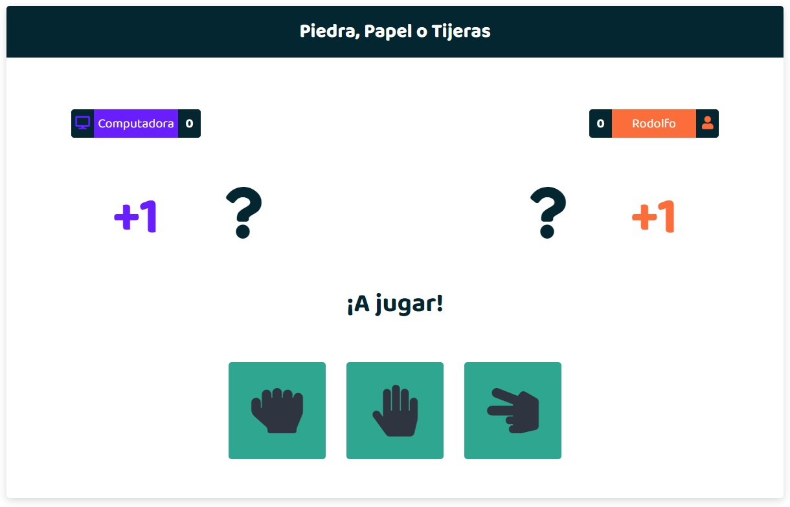

# Juego con HTML, CSS y JavaScript

## Piedra - Papel - Tijeras



Juego de Piedra, Papel o Tijeras

Inspirado en el curso de JavaScript de Fernando Herrera

### Notas:

Reconstruir los módulos de Node

```
npm install
```

Para compilar sass

```
npm run watch:sass
```

Para trabajar con Javascript

```
npm start
```

Y para construir el build, ejecuta:

```
npm run build
```
